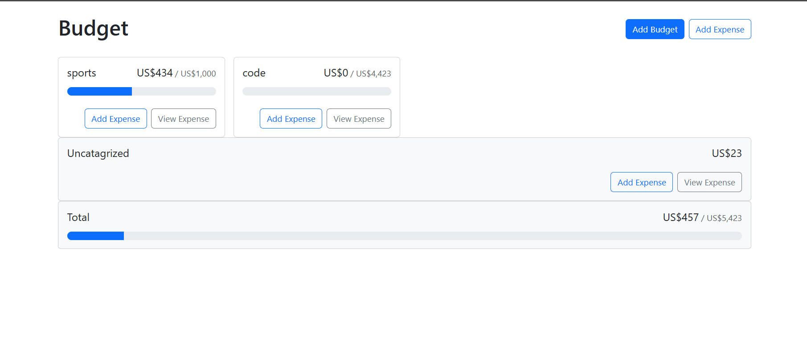

# Budget Tracker App

 <!-- Add a screenshot if available -->

A React-based expense tracking application that helps users manage their budgets and expenses efficiently using browser's local storage for data persistence.

## ✨ Features

- 📊 Create and manage multiple budget categories
- 💸 Add expenses to specific budgets
- 📅 Track expense history with dates
- 🔍 View expenses by category
- 💾 Local storage persistence (data remains after page refresh)
- 📱 Responsive design works on all devices

## 🛠 Technologies Used

- React.js (v18+)
- React Bootstrap (UI components)
- Local Storage (data persistence)
- React Context API (state management)
- date-fns (date formatting)

## 🚀 Installation

```bash
# 1. Clone the repository
git clone https://github.com/sheraz61/Expense-Manager

# 2. Navigate to project directory
cd Expense-Manager

# 3. Install dependencies
npm install

# 4. Start development server
npm start

# 5. Open in browser
http://localhost:3000
```
## 🏗 Project Structure
```
src/
├── Components/
│   ├── BudgetCard.js
│   ├── UncategorizedBudgetCard.js
│   ├── TotalBudgetCard.js
│   ├── AddBudgetModal.js
│   ├── AddExpenseModal.js
│   └── ViewExpensesModal.js
├── Context/
│   └── BudgetsContext.js
├── utils/
│   └── currencyFormatter.js
├── App.js
└── index.js
```
## 🔧 How It Works
### Data Storage
The app uses localStorage to persist:
Budget categories (name + max amount)
Expense records (amount, description, date, category)

All data stored in JSON format

### Key Components <br>
- Budgets Context - Central state management
- Budget Cards - Visual progress bars for each budget
- Add Budget Modal - Create new categories
- Add Expense Modal - Log new expenses
- View Expenses Modal - Detailed expense view

# 🌟 Future Improvements
- User authentication
- Data export/backup
- Visual charts
- Dark mode support
- Monthly/yearly views

